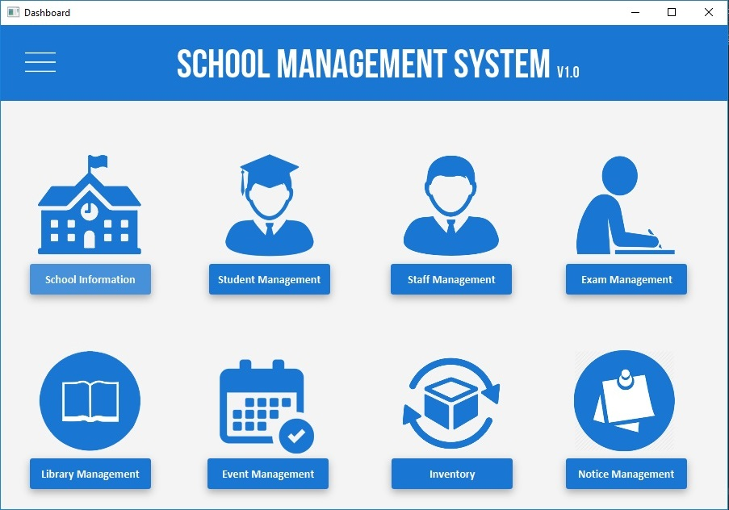

# School Management System
School Management System using Java FX
And also used UI and UX concepts and [JFoenix](http://www.jfoenix.com/) library

## Technologies Used
* JavaFX
* JFoenix (Material Design Library)
* Jasper Reports
* MySQL
* IntelliJ Idea Ultimate (IDE)

## Used Design Patterns
* MVC 
